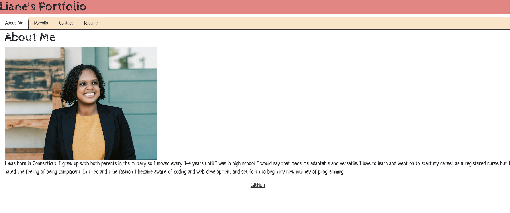

# React Portfolio

## Description

This portfolio was created to show my prior projects and work to future employers to assist them in further assessing if I am right for the respective positions.

## Installation

The steps needed to run this application is installing of `vite`, `react`, and `react-dom` dependencies.

## Usage

Provide instructions and examples for use. Include screenshots as needed.

To add a screenshot, create an `assets/images` folder in your repository and upload your screenshot to it. Then, using the relative file path, add it to your README using the following syntax:

